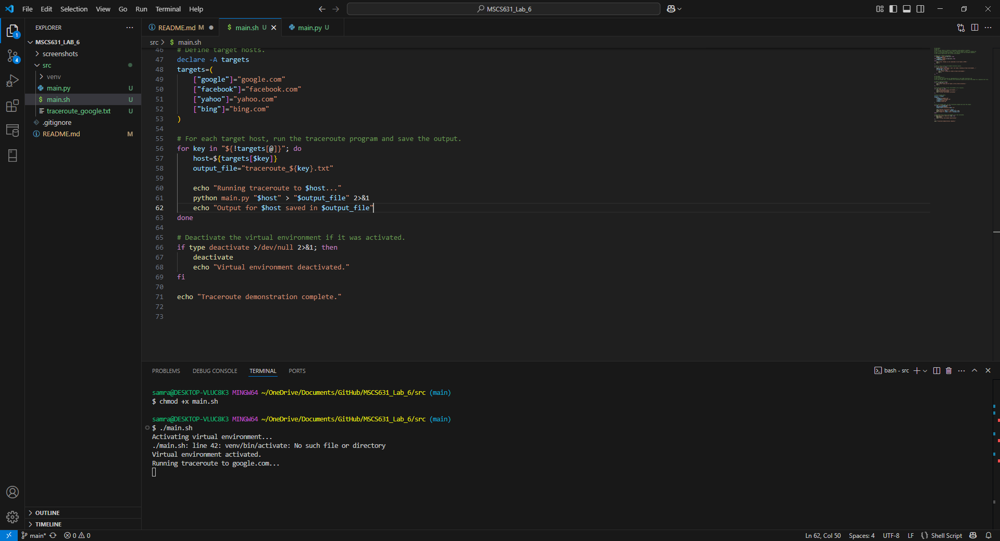
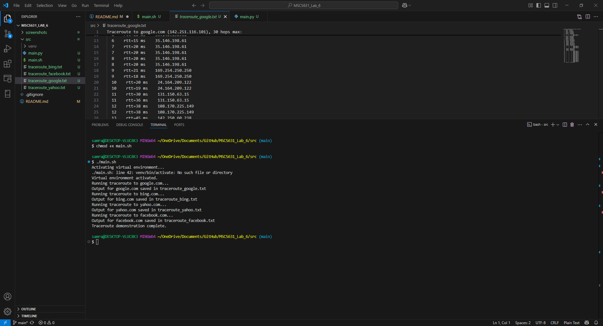
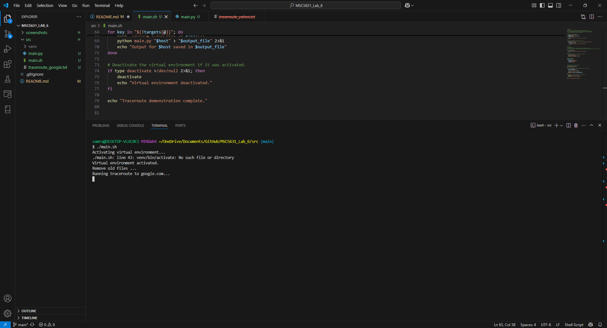
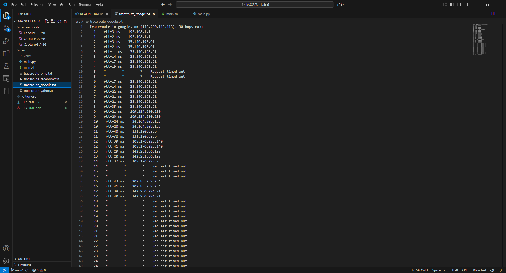

# Python Lab 6: ICMP Traceroute Assignment
Samrat Baral

Lab 6

University of the Cumberlands

2025 Spring - Advanced Computer Networks (MSCS-631-M40) - Full Term
Dr. Yousef Nijim

March 30, 2025

Implement a traceroute application using ICMP request and reply to messages

# Screenshot






## Overview

This assignment implements a simple traceroute application using ICMP echo requests and replies. The program sends ICMP echo request packets with progressively increasing TTL (Time-to-Live) values to trace the path from the source to the destination. Intermediate routers return ICMP "Time Exceeded" messages (type 11) when the TTL expires, and the destination host sends an ICMP echo reply (type 0).

## How It Works

- **Packet Creation:**  
  The `build_packet()` function constructs an ICMP Echo Request packet. It creates an ICMP header (using the process ID and a sequence number) and appends a data section containing a timestamp. The checksum is computed over the header and data to ensure packet integrity.

- **Checksum Calculation:**  
  The `checksum()` function computes the Internet checksum required for the ICMP packet by summing 16-bit words and taking the one's complement.

- **Traceroute Logic:**  
  The `get_route()` function sends the packet with increasing TTL values (from 1 up to a maximum of 30). For each TTL:
  - A raw socket is created and its TTL value is set.
  - The packet is sent and the program waits for an ICMP reply using a timeout.
  - The ICMP response is analyzed by extracting the ICMP type from the received packet:
    - **Type 11:** Indicates that a router has decremented the TTL to 0 (Time Exceeded).
    - **Type 3:** Indicates that the destination is unreachable.
    - **Type 0:** Indicates an echo reply from the destination, meaning the traceroute is complete.
  - The round-trip time (RTT) is calculated and displayed along with the IP address of the responding device.

- **Permissions:**  
  This program requires administrator/root privileges to create raw sockets.

## Usage

To run the traceroute program, use the following command:
 
# Ouput 
```bash
chmod +x main.sh
```

```bash
./main.sh
Activating virtual environment...
./main.sh: line 43: venv/bin/activate: No such file or directory
Virtual environment activated.
Remove old files ...
Running traceroute to google.com...
Output for google.com saved in traceroute_google.txt
Running traceroute to bing.com...
Output for bing.com saved in traceroute_bing.txt
Running traceroute to yahoo.com...
Output for yahoo.com saved in traceroute_yahoo.txt
Running traceroute to facebook.com...
Output for facebook.com saved in traceroute_facebook.txt
Traceroute demonstration complete.
```
# Experience and Challenges:
- Working on the ICMP Traceroute lab assignment was a rewarding and eye-opening experience. It allowed me to delve into the intricacies of network protocols by implementing raw socket communication in Python. Building and sending ICMP echo requests helped solidify my understanding of packet structure, including constructing headers, computing checksums, and handling timeouts using the select module. This hands-on approach not only deepened my theoretical knowledge but also improved my debugging skills, especially when it came to managing different ICMP response types and ensuring accurate round-trip time measurements.

- However, the project was not without its challenges. One significant hurdle was dealing with the permissions required for raw socket operations, which necessitated running the code with elevated privileges. Debugging issues related to packet construction and ICMP type extraction was also challenging, as it required careful attention to detail to correctly interpret the data returned by the network. Additionally, ensuring robust error handling and managing timeouts to gracefully handle unresponsive hosts tested my ability to write resilient code. These challenges ultimately enhanced my problem-solving skills and provided valuable insights into the practical aspects of network diagnostics.
